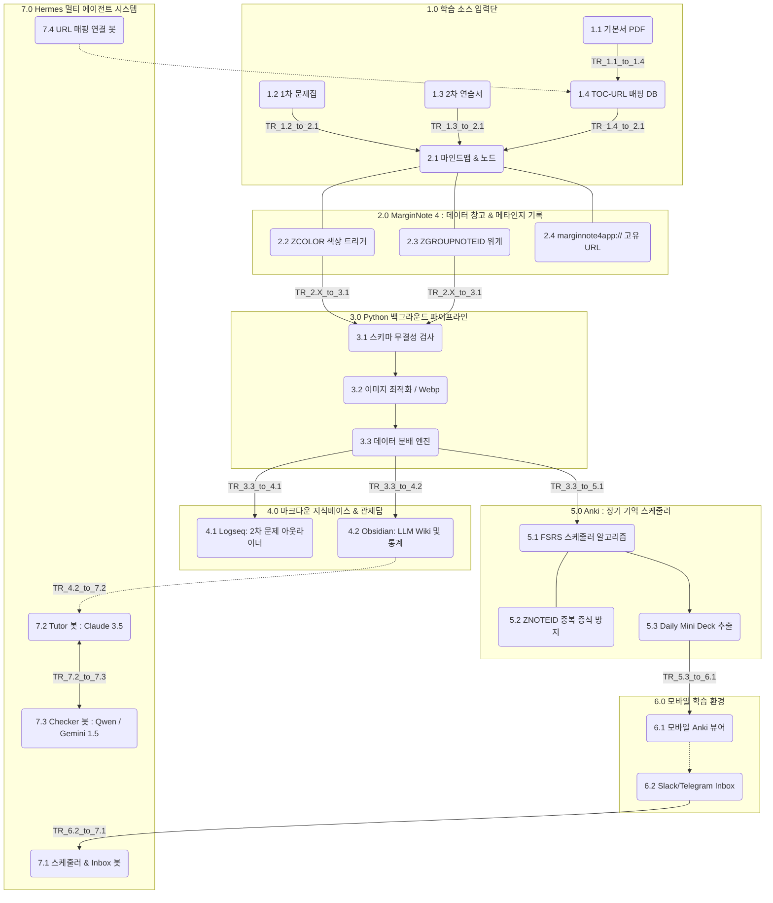

# CPA Super-gap System (초격차 학습 자동화 시스템)

이 프로젝트는 CPA 수험생을 위한 **초격차 학습 자동화 시스템**의 단일 저장소(Monorepo)입니다.

---

## 🗺️ CPA 초격차 시스템 전체 아키텍처 및 상세 명세 (마스터 구조도)

이 문서는 분업을 위한 **마스터 단일 문서**입니다. 구조도 내의 번호를 클릭하거나 하단 목차를 통해 모듈별 상세 사양서(새끼 문서)로 이동할 수 있습니다.

## 📑 시스템 모듈별 참조 문서 (팀 단위 작업 스펙)

> **각 파트 담당자는 자신의 모듈 번호에 해당하는 문서를 클릭하여 상세 사양을 확인하고 코드를 구현하십시오.**

### 1.0 학습 소스 입력단 (Input Sources)
- [1.1 기본서 PDF](docs/module_specs/1.0_Input_Sources/1.1_pdf_toc_extractor.md)
- [1.2 1차 문제집](docs/module_specs/1.0_Input_Sources/1.2_mcq_slicer.md)
- [1.3 2차 연습서](docs/module_specs/1.0_Input_Sources/1.3_essay_slicer.md)
- [1.4 TOC-URL 매핑 DB](docs/module_specs/1.0_Input_Sources/1.4_toc_url_mapper.md)

### 2.0 MarginNote 4 엔진
- [2.1 마인드맵 & 노드](docs/module_specs/2.0_MarginNote_Engine/2.1_mindmap_node.md)
- [2.2 ZCOLOR 색상 트리거](docs/module_specs/2.0_MarginNote_Engine/2.2_zcolor_trigger.md)
- [2.3 ZGROUPNOTEID 위계](docs/module_specs/2.0_MarginNote_Engine/2.3_zgroup_hierarchy.md)
- [2.4 marginnote4app 고유 URL](docs/module_specs/2.0_MarginNote_Engine/2.4_marginnote_url.md)

### 3.0 파이프라인
- [3.1 스키마 무결성 검사](docs/module_specs/3.0_Data_Pipeline/3.1_schema_checker.md)
- [3.2 이미지 최적화 Webp](docs/module_specs/3.0_Data_Pipeline/3.2_image_optimizer.md)
- [3.3 데이터 분배 엔진](docs/module_specs/3.0_Data_Pipeline/3.3_data_router.md)

### 4.0 지식베이스
- [4.1 Logseq 2차 문제 아웃라이너](docs/module_specs/4.0_Knowledge_Base/4.1_logseq_outliner.md)
- [4.2 Obsidian LLM Wiki](docs/module_specs/4.0_Knowledge_Base/4.2_obsidian_wiki.md)

### 5.0 Anki 스케줄러
- [5.1 FSRS 스케줄러 알고리즘](docs/module_specs/5.0_Anki_Scheduler/5.1_fsrs_algorithm.md)
- [5.2 ZNOTEID 중복 방지](docs/module_specs/5.0_Anki_Scheduler/5.2_znoteid_dedup.md)
- [5.3 Daily Mini Deck 추출](docs/module_specs/5.0_Anki_Scheduler/5.3_daily_mini_deck.md)

### 6.0 모바일 학습 환경
- [6.1 모바일 Anki 뷰어](docs/module_specs/6.0_Mobile_Environment/6.1_mobile_anki.md)
- [6.2 Slack/Telegram Inbox](docs/module_specs/6.0_Mobile_Environment/6.2_telegram_inbox.md)

### 7.0 멀티 에이전트
- [7.1 스케줄러 & Inbox 봇](docs/module_specs/7.0_Agents/7.1_scheduler_bot.md)
- [7.2 Tutor 봇 : Claude 3.5](docs/module_specs/7.0_Agents/7.2_tutor_bot.md)
- [7.3 Checker 봇 : Qwen / Gemini](docs/module_specs/7.0_Agents/7.3_checker_bot.md)
- [7.4 URL 매핑 연결 봇](docs/module_specs/7.0_Agents/7.4_url_linker_bot.md)

### TR 파이프라인 브릿지 스크립트
- [TR_1.1_to_1.4_toc_extract](docs/module_specs/8.0_bridges_transitions/TR_1.1_to_1.4_toc_extract.md)
- [TR_1.2_to_2.1_mcq_slice](docs/module_specs/8.0_bridges_transitions/TR_1.2_to_2.1_mcq_slice.md)
- [TR_1.3_to_2.1_essay_split](docs/module_specs/8.0_bridges_transitions/TR_1.3_to_2.1_essay_split.md)
- [TR_1.4_to_2.1_reverse_insert](docs/module_specs/8.0_bridges_transitions/TR_1.4_to_2.1_reverse_insert.md)
- [TR_2.X_to_3.1_db_hook](docs/module_specs/8.0_bridges_transitions/TR_2.X_to_3.1_db_hook.md)
- [TR_3.3_to_4.1_logseq_push](docs/module_specs/8.0_bridges_transitions/TR_3.3_to_4.1_logseq_push.md)
- [TR_3.3_to_4.2_obsidian_push](docs/module_specs/8.0_bridges_transitions/TR_3.3_to_4.2_obsidian_push.md)
- [TR_3.3_to_5.1_anki_push](docs/module_specs/8.0_bridges_transitions/TR_3.3_to_5.1_anki_push.md)
- [TR_5.3_to_6.1_mini_deck_push](docs/module_specs/8.0_bridges_transitions/TR_5.3_to_6.1_mini_deck_push.md)
- [TR_6.2_to_7.1_inbox_relay](docs/module_specs/8.0_bridges_transitions/TR_6.2_to_7.1_inbox_relay.md)
- [TR_4.2_to_7.2_rag_search](docs/module_specs/8.0_bridges_transitions/TR_4.2_to_7.2_rag_search.md)
- [TR_7.2_to_7.3_cross_check](docs/module_specs/8.0_bridges_transitions/TR_7.2_to_7.3_cross_check.md)
