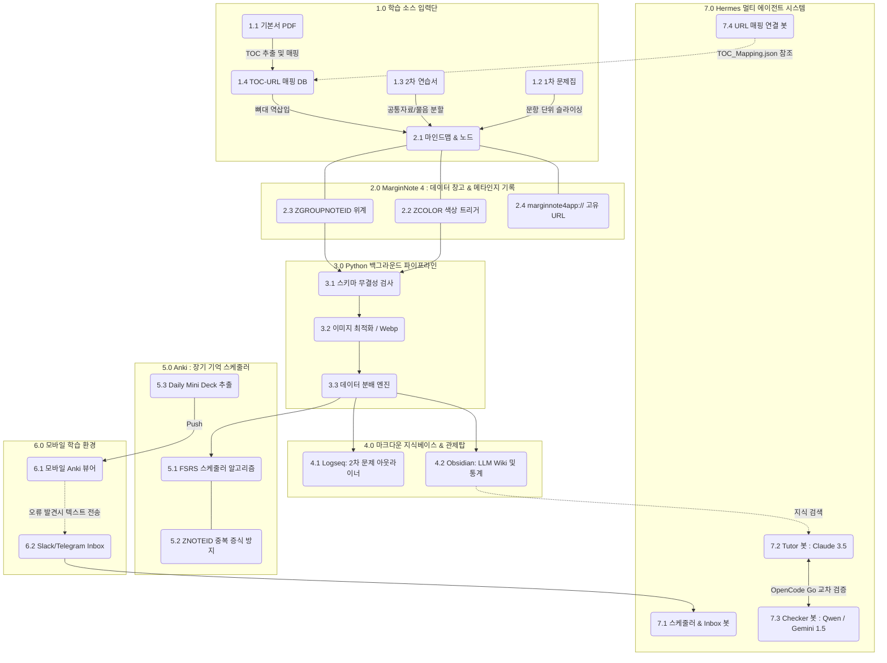

# CPA 초격차 학습 자동화 시스템 : 통합 아키텍처 및 백과사전 (Ultimate Wiki)

> **💡 [문서 개요]**
> 본 문서는 CPA 수험생을 위한 "자율형 AI 사이보그 컨설턴트" 시스템의 **모든 아키텍처, 파이프라인, 한계점 방어 논리, 그리고 인지적 UX(User Experience)**를 집대성한 단일 진실 공급원(Single Source of Truth)입니다.
> 과거에 존재했던 여러 문서들의 파편화된 논리(TOC 추출, Logseq 아웃라이너, ZCOLOR 색상 트리거 등)를 하나의 거대한 생태계로 엮어 구조도를 그렸으며, 도식화된 각 항목 번호에 대해 가장 상세한 작동 원리를 서술합니다. 빠진 내용은 단 하나도 없습니다.

---

## 🗺️ CPA 초격차 시스템 전체 아키텍처 (Mermaid 구조도)

아래는 학습 자료의 '입력'부터 AI 에이전트의 '관제 및 피드백'까지 이어지는 전체 데이터 흐름도입니다. 각 노드에 부여된 번호(예: `1.1`, `2.2`)는 하단의 상세 설명과 1:1로 매칭됩니다.

> 🔎 **[시각화 도구로 보기]** 
> 다이어그램이 한눈에 들어오지 않는다면, 브라우저에서 넓게 볼 수 있는 [CPA_시스템_구조도.html](file:///Users/na/Desktop/CPA_시스템_구조도.html) 파일을 열어보세요!

---

## 📖 시스템 모듈별 상세 명세서 (Node Breakdown)

### [1.0] 학습 소스 입력단 (Input Sources)
모든 학습의 원천 재료입니다. 교재의 성격에 따라 데이터의 형태와 처리 방식이 완전히 다릅니다.
* **1.1 기본서 PDF:** 개념서입니다. 텍스트 자체가 문제로 파싱되지 않으며, 오직 '목차(TOC)'를 추출하여 시스템 전체의 뼈대를 만드는 데 사용됩니다.
* **1.2 1차 문제집 (객관식):** '문항' 단위로 쪼개지는(Slicing) 교재입니다. 이미지 슬라이싱 시스템을 통해 개별 문항 번호와 해설이 각각 독립된 노드로 추출됩니다.
* **1.3 2차 연습서 (주관식):** 가장 복잡한 구조를 가진 교재입니다. 하나의 긴 시나리오(공통 자료) 밑에 여러 개의 '새끼 물음(물음 1, 물음 2...)'이 달리는 계층형 구조(Hierarchy)를 갖습니다.
* **1.4 TOC-URL 매핑 DB (★시스템 근본 해답 1):** 기본서의 목차(예: `1.1.1 자산손상`)를 파이썬 스크립트가 추출할 때, 각 목차가 MarginNote에 임포트되면서 생성되는 고유 주소(`marginnote4app://...`)를 1:1로 묶어 `TOC_Mapping.json` 사전에 저장해 둡니다. 이 주소록 덕분에 사용자가 수동으로 URL을 복사해 붙여넣는 '스파게티 선긋기 노동'에서 해방됩니다.

### [2.0] MarginNote 4 (데이터 창고 및 메인 엔진)
PDF를 띄워놓고 펜슬로 형광펜을 긋거나 메모를 하는 '창고'이자, 사용자의 인지적 행위가 코드로 번역되는 핵심 엔진입니다.
* **2.1 마인드맵 & 노드:** 교재의 내용이 블록(노드) 형태로 분할되어 시각화됩니다.
* **2.2 ZCOLOR 색상 트리거 (★시스템 근본 해답 2):** 과거의 가장 큰 골칫거리였던 '텍스트 파싱 오류(띄어쓰기, 오타)'를 완벽히 해결한 기술입니다. SQLite DB인 `.marginnotes` 파일 내의 `ZBOOKNOTE` 테이블에는 사용자가 칠한 색상이 `ZCOLOR`라는 숫자 인덱스(예: 빨강=2, 초록=3)로 저장됩니다. 시스템은 "빨간색 노드는 무조건 ⚠주의 카드, 초록색 노드는 무조건 📋절차 카드"로 인식하므로, 사용자는 키보드 타이핑 없이 오직 펜슬 색상 변경만으로 카드의 종류를 100%의 정확도로 제어합니다.
* **2.3 ZGROUPNOTEID 위계:** 마진노트 안에서 사용자가 네모 박스로 노드들을 묶는 행위(Grouping)가 곧 DB에 부모-자식 위계로 기록됩니다. Logseq에서 수동으로 탭(Tab) 키를 쳐가며 위계를 잡아주던 인지적 노동을 없애고, 마진노트의 시각적 묶음을 '단일 진실 공급원'으로 취급합니다.
* **2.4 marginnote4app:// 고유 URL:** 마진노트의 모든 노드가 갖는 영구적인 딥링크입니다. 외부 앱(Anki, Obsidian) 어디서든 이 링크를 누르면 즉시 마진노트의 해당 페이지, 해당 밑줄로 시야가 워프(Warp)합니다.

### [3.0] 파이썬 백그라운드 파이프라인 (Data Pipeline)
Mac이 상시 켜져(Always-On) 있는 환경에서, 사용자 몰래 뒤에서 데이터를 정제하고 쏘아주는 배관공입니다.
* **3.1 스키마 무결성 검사 (침묵 실패 방어):** 마진노트 앱이 메이저 업데이트되어 DB 구조가 바뀌면 시스템이 망가집니다. 이를 방어하기 위해 파이프라인은 항상 `PRAGMA table_info(ZBOOKNOTE)`를 실행해 스키마 변경 여부를 검사하고, 이상이 있으면 작동을 멈추고 스마트폰(Slack)으로 긴급 알림을 보냅니다.
* **3.2 이미지 최적화 / Webp 변환:** 동기화 폭발을 막기 위해, 교재 스크린샷 등을 Anki로 넘기기 전 강제로 해상도를 축소하고 .webp 포맷으로 압축하여 용량을 80% 이상 절감합니다.
* **3.3 데이터 분배 엔진:** 추출된 텍스트, 이미지, 위계 정보, 색상 정보를 종합하여 Logseq, Obsidian, Anki로 알맞게 쪼개어 배달하는 핵심 스크립트입니다.

### [4.0] 마크다운 지식베이스 & 관제탑 (Knowledge Base)
에이전트가 읽고, 사용자가 숲을 조망하는 곳입니다.
* **4.1 Logseq (2차 문제 아웃라이너):** 2차 주관식 연습서처럼 [공통 자료] 하나에 [물음 1], [물음 2]가 딸려 있는 복잡한 계층 구조를 가장 완벽하게 담아내는 아웃라이너(Outliner)입니다. 2차 문제 훈련의 본진 역할을 합니다.
* **4.2 Obsidian (LLM Wiki 및 통계):** 일반적인 개념서 정리 및 전체 지식망을 아우르는 관제탑입니다. Dataview 플러그인과 Graph View를 통해 '나의 약점 개념'을 대시보드로 시각화하며, 향후 튜터 에이전트(LLM)가 사용자의 수준을 평가하기 위해 읽어들이는 RAG(검색 증강 생성) 지식 창고입니다.

### [5.0] Anki (장기 기억 스케줄러)
* **5.1 FSRS 스케줄러 알고리즘:** 전통적인 SM-2 알고리즘을 넘어선 최신 AI 망각 곡선 알고리즘입니다. 에이전트나 스크립트가 임의로 카드의 듀데이트를 건드려 이 과학적 곡선을 훼손하지 못하도록 방어벽을 칩니다.
* **5.2 ZNOTEID 중복 증식 방지:** 스크립트가 하루에 100번 돌더라도 카드가 중복 생성되지 않는 이유는 Anki 카드 뒷면 숨긴 필드에 마진노트의 `ZNOTEID`가 박혀있기 때문입니다. 수동으로 카드를 분리/병합하면 이 ID가 파괴되어 데이터가 꼬일 수 있으므로, "Anki 내에서는 절대 수정/분리 금지" 정책을 적용합니다.
* **5.3 Daily Mini Deck (데일리 미니 덱) 추출:** 시험이 다가올수록 동기화 데이터가 무거워져 스마트폰이 멈추는 현상을 막기 위해, 에이전트가 "오늘 복습할 카드"만 아주 가볍게 떼어내어 모바일로 Push(전송)하는 방식을 지원합니다.

### [6.0] 모바일 학습 환경 (Inbox 패턴)
* **6.1 모바일 Anki 뷰어:** 외출 중 지하철 등에서 암기 및 인출을 수행합니다. 절대 이곳에서 카드의 내용을 편집하지 않습니다. (단방향 덮어쓰기로 인한 데이터 증발 방지)
* **6.2 Slack/Telegram Inbox:** 모바일에서 오타를 발견하거나 아이디어가 떠오르면, 카드를 고치지 않고 메신저 봇에게 "15번 문제 해설 오타 있음"이라고 툭 던져놓습니다. 귀가 후 Mac에 앉았을 때 이 Inbox를 비우며 원본(MarginNote/마크다운)을 수정하는 강력한 데이터 손실 방어 패턴입니다.

### [7.0] Hermes 멀티 에이전트 시스템 (Agents)
수동 텍스트 타이핑과 번호 암기의 고통을 없애주는 '사이보그 비서진'입니다.
* **7.1 스케줄러 & Inbox 봇:** 6.2에서 날아온 메시지를 수신하여 정리해주거나, "오늘 피곤하니 분량 좀 줄여줘"라는 요청을 받아 Anki FSRS Helper API를 통해 과학적으로 스케줄을 연기(Postpone)해 줍니다.
* **7.2 Tutor 봇 (Claude 3.5 Sonnet) & 7.3 Checker 봇 (Qwen / Gemini 1.5):** 사용자가 회계학 질문을 던지면 Tutor가 대답합니다. 이때 AI 특유의 환각(Hallucination)으로 틀린 답을 지어내는 것을 막기 위해, OpenCode Go 환경을 활용하여 아키텍처가 전혀 다른 Checker 봇이 교차 검증(Cross-check)을 수행합니다. 둘 다 동의해야만 사용자에게 답변이 노출됩니다.
* **7.4 URL 매핑 연결 봇:** 사용자가 목차 번호를 외울 필요 없이, **"방금 틀린 문제랑 자산손상 연결해줘"**라고 던지면 봇이 `1.4 TOC-URL 매핑 DB`를 뒤져 자산손상의 `marginnote4app://` 고유 주소를 찾아 백그라운드에서 조용히 마크다운/Anki 파일에 링크를 쏴줍니다. 스파게티 연결의 완전한 종식을 이끌어냅니다.

---
**[문서 끝. 본 백과사전은 시스템 아키텍처 구축과 LLM 프롬프트 개발 시 단일 진실 공급원(SSOT)으로 기능합니다.]**
