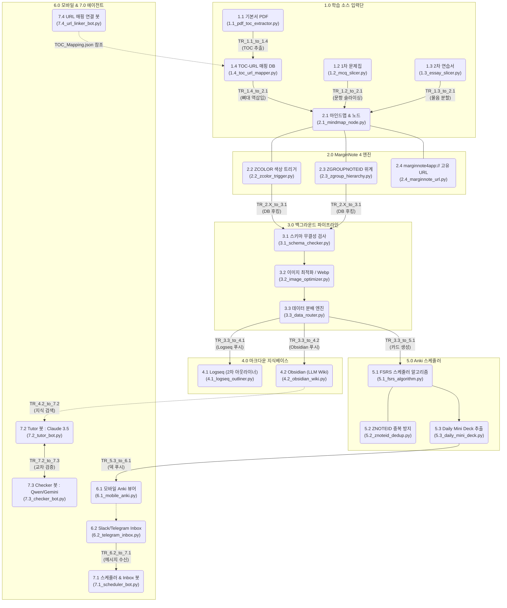

# CPA Super-gap System (초격차 학습 자동화 시스템)

이 프로젝트는 CPA 수험생을 위한 **초격차 학습 자동화 시스템**의 단일 저장소(Monorepo)입니다.
Windows와 Mac 환경 모두에서 인간 지휘관(Commander)과 여러 AI 에이전트들이 원활하게 협업할 수 있도록 구성되었습니다.

---

## 🧭 에이전트 필수 숙지 가이드 (Agent Context)

> **⚠️ 어떤 환경(Windows/Mac)에서 깨어난 에이전트이든, 코드를 수정하기 전에 이 섹션을 완벽히 숙지해야 합니다.**

이 프로젝트는 지휘관의 "숫자 지시"에 따라 1:1로 매칭되는 파일 시스템 아키텍처를 가지고 있습니다.
지휘관이 **"3.2 작업해"** 라고 지시하면, 에이전트는 무조건 `src/3.0_data_pipeline/3.2_image_optimizer.py` 파일을 열어 작업해야 합니다.

### 📌 [1.0 ~ 8.0] 시스템 아키텍처 다이어그램 및 소스 코드 매핑

아래 다이어그램은 각 기능의 **"기존 한글 명칭"**과 **"실제 개발되는 파이썬 파일명"**을 함께 매핑한 최종 구조도입니다. 프로젝트 루트의 `CPA_최종_시스템_구조도_V3.html`을 브라우저에서 열면 더 크게 볼 수 있습니다.



👉 **에이전트 행동 지침**: 시스템 구조와 배경 지식에 대해 의문이 생기면 즉시 `docs/wiki_references/AI_REFERENCE_WIKI.md` 문서를 열어 과거 마스터플랜과 한계점 극복 로그를 읽어라.

---

## 🚀 빠른 시작 가이드 (Windows 환경 우선)

지휘관 및 팀원들이 시스템을 실행하고 테스트할 수 있도록 돕는 매뉴얼입니다.

### 1. 사전 준비 (Prerequisites)
- **Python 3.10 이상** 설치 (설치 시 `Add Python to PATH` 체크 필수)
- **Git** 설치 (버전 관리용)

### 2. 프로젝트 세팅
1. 명령 프롬프트(CMD)나 PowerShell을 열고 프로젝트 폴더로 이동합니다.
   ```cmd
   cd C:\경로\CPA_Supergap_System
   ```
2. 필요한 파이썬 라이브러리를 설치합니다.
   ```cmd
   pip install -r requirements.txt
   ```

### 3. 환경 설정 (config.yaml)
`config/config.yaml` 파일을 열고, Windows 환경에 맞는 경로(`windows:` 하위)를 본인의 PC 환경에 맞게 수정합니다.
- `pdf_input_dir`: PDF 파일들이 모여있는 폴더 경로
- `output_dir`: 추출된 결과물(OPML 등)이 저장될 폴더 경로

### 4. 모듈 실행 테스트 (예: 1.1 TOC 추출기)
가장 처음 구동해볼 수 있는 파이프라인은 [1.1] 모듈입니다.
```cmd
python src/1.0_input_sources/1.1_pdf_toc_extractor.py
```
