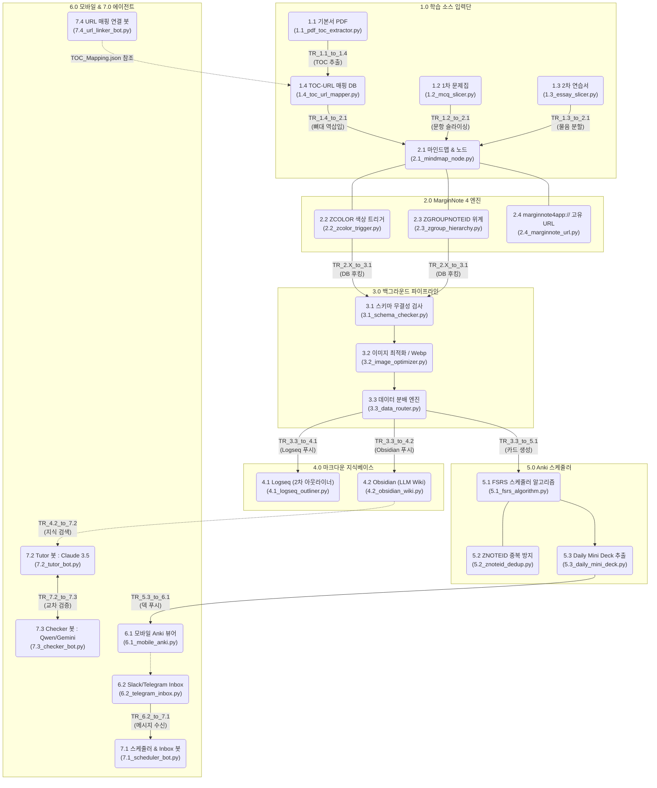

# CPA 초격차 시스템 - 디렉토리와 원본 구조도(위키) 매핑 다이어그램

지휘관님께서 보시던 원본 **[시스템 구조도]**의 노드들이, 실제 우리가 작업할 **[소스 코드 폴더(디렉토리)]**와 어떻게 1:1로 정확하게 매칭되는지 시각화한 다이어그램입니다.

새로 매긴 목차가 아니라, **원본 위키의 번호 체계(1.0 ~ 7.0)를 소스 코드 폴더명에 그대로 박아넣은 것**입니다. 이를 통해 코드만 봐도 시스템 구조도의 어느 부분인지 즉각적으로 알 수 있습니다.

## 🛠️ 최고 사령관 전용 커뮤니케이션 가이드

본 매핑 룰은 Google Drive에 동기화되어 있으며, 어떠한 환경(OS)에서도 에이전트들은 이 문서를 SSOT(Single Source of Truth)로 삼습니다.

지휘관님께서는 작업 시 **"명령어 + 번호"** 조합으로 지시하십시오.

**[예시]**
- *"1.4에 URL 매핑하는 정규식 추가해"* 👉 `src/1.0_input_sources/1.4_toc_url_mapper.py` 수정
- *"3.2 이미지 최적화 Webp 화질을 80%로 낮춰"* 👉 `src/3.0_data_pipeline/3.2_image_optimizer.py` 수정
- *"7.2 프롬프트를 수정해서 회계학 답변 퀄리티를 올려"* 👉 `src/7.0_hermes_agents/7.2_tutor_bot.py` 수정

이처럼 숫자만으로 시스템 100%를 장악하실 수 있습니다.
